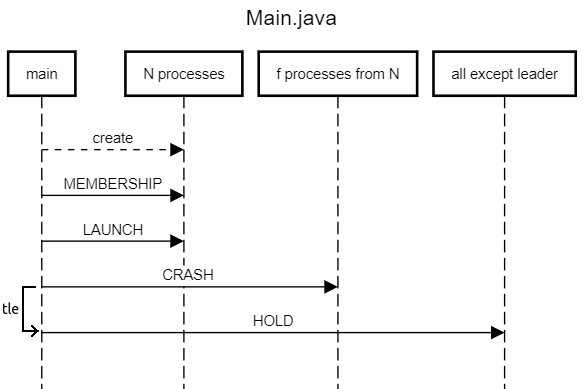
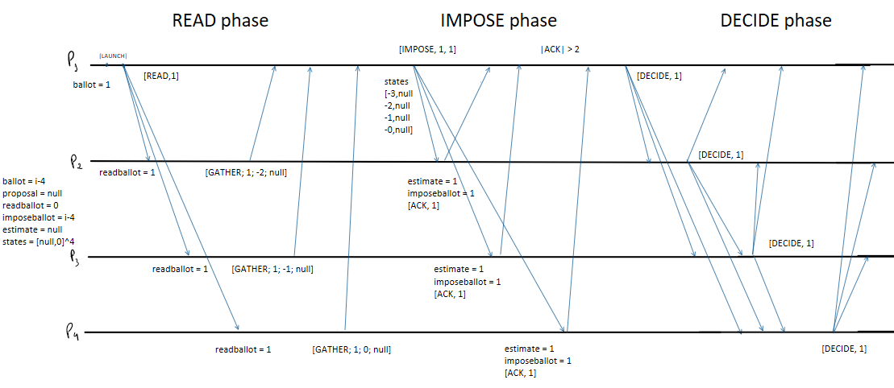

# Project: Obstruction-Free Consensus and Paxos - Implemented in JAVA

Project implemented by:

Lucas PALMIRO DE FREITAS, Rafael ISSLER RODRIGUES, and Tarcisio DA SILVA BUENO.

## Problem Statement

The aim of this project is to design and implement a state-machine replicated system built atop a consensus abstraction. More specifically, the problem addressed is how to implement an algorithm that solves obstruction-free consensus.

The solution algorithm must meet the following properties required by the abstraction:

1. **Validity**: every decided value is a proposed value.
2. **Agreement**: no two processes decide differently.
3. **Obstruction-free termination**:
    1. If a correct process proposes, it eventually decides or aborts.
    2. If a correct process decides, no correct process aborts infinitely often.
    3. If there is a time after which exactly one correct process p proposes a value sufficiently many times, p eventually decides.

Additionally, we consider that an obstruction-free consensus (OFC) algorithm exports one operation `propose(v)` with an input value in a set $\( v \in V = \{0, 1\} \)$.

When a process invokes `propose(v)`, we say that the process *proposes v*, and it must be able to invoke the `propose` operation multiple times. Thus, the operation must return either a value $\( v' \in V \)$, in which case we say that the process *decides v'*, or a special value `abort` $\( \notin V \)$, in which case we say that the invocation *aborts*.

The environment settings in which the solution algorithm will run are as follows:

- We have N asynchronous processes and each of them has a distinct identifier that is publicly known.
- Every two processes can communicate via a reliable asynchronous point-to-point channel.
- Up to $\( f < \frac{N}{2} \)$ of the processes are subject to crash failures: a faulty process prematurely stops taking steps of its algorithm. On the other hand, a process that never crashes is called correct.

## Implementation

The implemented algorithm is based on the Synod algorithm, which is the “optimistic” consensus protocol in Paxos state-machine replication protocol.

In addition to implementing Synod, we induce an arbitrary leader election in order to ensure the termination of the algorithm, i.e. that a value will eventually be decided. Termination is guaranteed since this arbitrarily chosen leader will, at some point, be the only correct process proposing and, due to the obstruction-free termination property guaranteed by Synod, this leader process will eventually decide.

For the implementation, we used the AKKA framework which is based on the actor model, in which the actors represented by the processes exchange messages simultaneously. Thus, for each type of message present in the Synod algorithm, we created a class with its own parameters in brackets:

- class `Read (int ballot)`
- class `Gather (int ballot, int estballot, Boolean est, int i)`
- class `Impose (int ballot, Boolean v)`
- class `Ack (int ballot)`
- class `Decide (Boolean v)`
- class `Abort (int ballot)`

In addition, we have included other types of messages that are used by the `Main` class to control the execution of the algorithm:

- class `Membership (List<ActorRef> references)`: message used to provide each actor or process with references to all the other processes in the system.
- class `Launch ()`: message sent to all processes to trigger their operation and start the execution of the distributed algorithm.
- class `Crash ()`: message sent to the $\( f \)$ faulty processes so that they enter fault-prone mode, in which, for any event processed in the algorithm, the process decides, with a fixed probability of $\( \alpha \)$, whether it is going to crash.
- class `Hold ()`: message sent to all processes except the leader to cause non-leader processes to stop proposing, making the leader process the only one to propose from some point onwards.

### How the Implementation Functions

*Figure 1: Sequence Diagram for `Main` class*

In the previous diagram, we represented as the time to election ($\( tle \$)) the time period waited by the `Main` class between the assignment of $\( f \)$ faulty processes, which is implemented by sending them `Crash` messages, and the leader election, which here is implemented by sending `Hold` messages to all processes except the leader so that they stop proposing.

We can see a basic run of the algorithm which can be divided into three phases: `READ` phase, `IMPOSE` phase, and `DECIDE` phase. In this basic run, we assume that only one process proposes. First, process $\( P_1 \)$ sends (including itself) a `READ` message containing its ballot number. Processes can respond with an `ABORT` message if they have seen a greater ballot or with a `GATHER` otherwise. In this case, they all respond with `GATHER` messages. $\( P_1 \)$ then receives a majority of `GATHER` messages and checks if there are non-NULL values of estballot, if so, it picks the value associated with the highest estballot. Otherwise, it picks its own value. It then proceeds to send `IMPOSE` messages to all processes. When processes receive this message, they can send an `ABORT` message or an `ACK` message based on the conditions of the pseudocode presented above. In our case, all processes send an `ACK` message. Once $\( P_1 \)$ receives a majority of messages of this type, it decides and sends the message `DECIDE` to all the processes. Once processes receive `DECIDE`, they also send this message to every other process.

*Figure 2: Phases of the algorithm*

The `Process` class encapsulates the behavior that each process in the system must adhere to. This behavior is outlined in the pseudocode of the Synod algorithm presented earlier. Below, we describe some important details about our implementation of the algorithm.

In our implementation, the proposed values are represented by Boolean objects, which can be either `True`, `False` or `Null`.

When a process proposes or imposes, it waits for a majority of responses to their `READ` and `IMPOSE` messages. To check that a majority of responses has been sent, we maintain separate counters for the `GATHER` and `ACK` messages. The implementation of this behavior was a source of one of the problems we encountered because processes sometimes would not decide when the number of processes was high. This erratic behavior was caused by processes parsing past messages. For example, process $\( P \)$ could send a `READ` message to all processes, but receive the `ABORT` command from one of them and then immediately re-propose. In this case, the other processes could send promises (`GATHER` messages) to $\( P \)$ about the old proposal, which can result in unintended behavior. To fix this, whenever the process receives a `GATHER` or `ACK` message, it checks if the ballot contained in the messages is equal to its current ballot.

The process can also receive `ABORT` messages for a ballot it is trying to propose or impose. In that case, it stops its propose or impose process, increases its ballot number, and proposes again.

As depicted in the picture above, when $\( f \)$ processes receive a `CRASH` message, they transition into a new state called FAULTY. In this state, upon receiving a message, each process generates a random number between 0 and 1 and compares it to $\( \alpha \)$. If the generated value is less than $\( \alpha \)$, the process enters another new state named SILENT. In this state, as the name implies, the process stops sending messages or responding to incoming messages.

